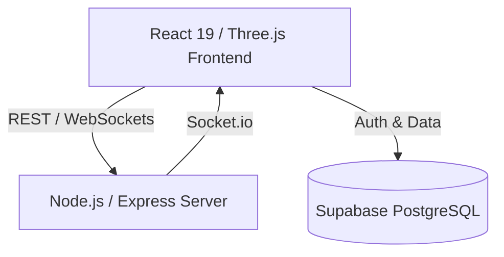
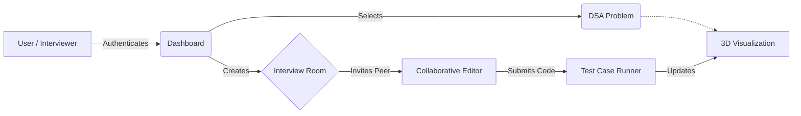
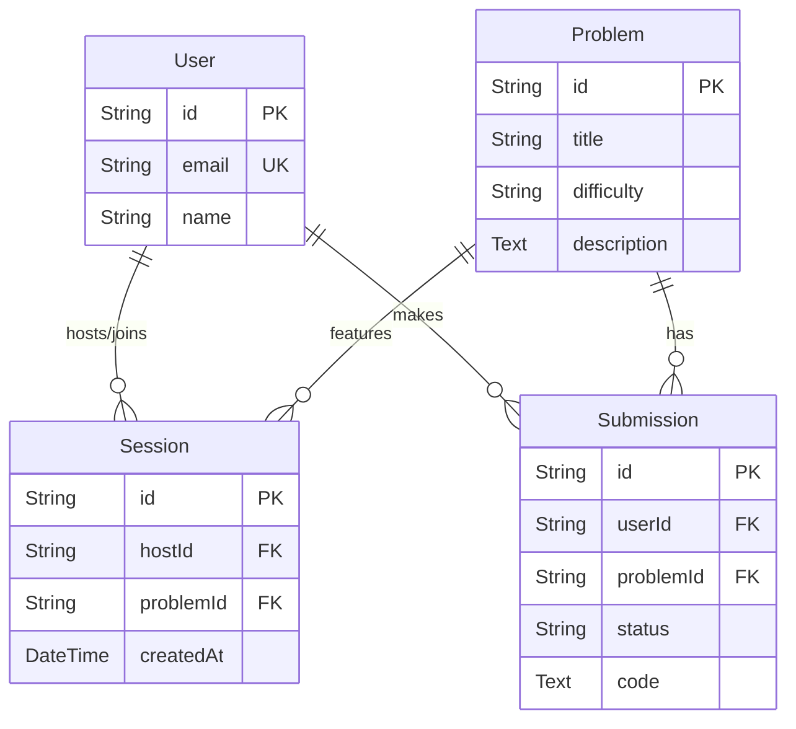
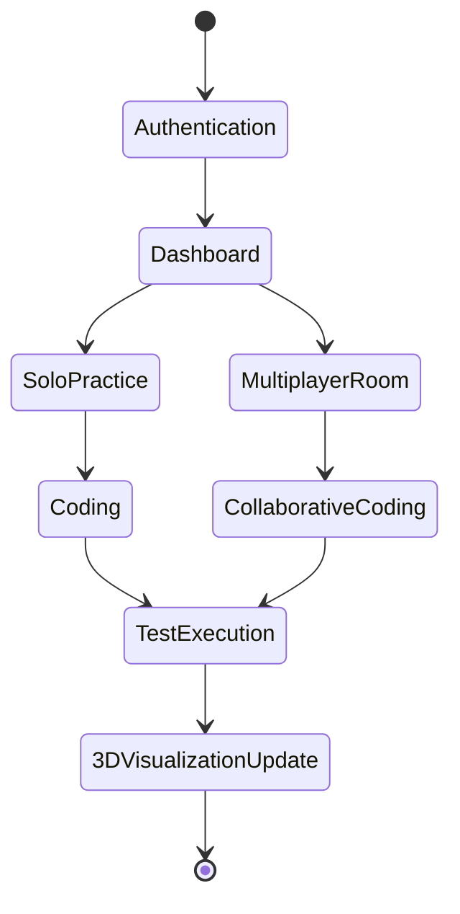

<div align="center">
  <!-- You can replace the src below with a custom logo if you have one -->
  <!--  -->

  <h1>AlgoHire</h1>
  <p><b>Revolutionizing DSA Learning & Technical Interviews with 3D Visualization</b></p>

  <p>
    
    
    
    
    
    
  </p>
</div>

---

## 📌 Overview

**The Problem:** Data Structures and Algorithms (DSA) are the backbone of computer science, yet they remain highly intimidating. Static 2D diagrams and disconnected coding environments make it difficult to build strong spatial and conceptual understanding, while remote technical interviews lack engaging, collaborative tools.

**The Solution:** **AlgoHire** is a comprehensive platform that combines **3D Interactive Learning** with **Collaborative Problem Solving**. It bridges the gap by bringing algorithms to life in an interactive 3D space and providing a seamless, real-time multiplayer environment tailored for mock interviews and technical assessments.

---

## ✨ Key Features

| Area | Features |
| :--- | :--- |
| 🎲 **3D Visualizations** | Interactive, step-by-step 3D renders of Arrays, Stacks, Queues, Trees, and Graphs. |
| 💻 **Integrated Code Editor** | Monaco-powered editor with syntax highlighting and live execution. |
| 👥 **Multiplayer Sessions** | Private rooms with sub-second real-time keystroke synchronization. |
| 🎯 **Problem Sets** | Curated LeetCode-style DSA problems with predefined test cases. |
| ⚡ **Instant Feedback** | Real-time code evaluation and correctness checking. |
| 🛡️ **Secure Auth** | Integrated Supabase authentication for users and interviewers. |

---

## 🏗 Architecture

### System Architecture


### Flowchart


---

## 🗄 Database Design



---

## 🔄 Business Workflow



---

## 📁 Folder Structure

```text
AlgoHire/
├── server/                 # Node.js/Express Backend with Socket.io
│   ├── index.js            # Main server entry point
│   └── ...
├── src/                    # React Frontend
│   ├── assets/             # Static assets
│   ├── auth/               # Authentication components
│   ├── components/         # Reusable UI & 3D components
│   ├── store/              # State management
│   └── ...
├── public/                 # Public assets
├── vite.config.ts          # Vite configuration
└── package.json            # Project dependencies & scripts
```

---

## 🚀 Installation

### 1. Clone the repository
```bash
git clone https://github.com/dhrumilmk06/AlgoHire.git
cd AlgoHire
```

### 2. Install dependencies
```bash
# Install both frontend and backend dependencies
npm install
```

### 3. Setup Environment Variables
Create a `.env` file in the root directory and configure your variables.
```bash
cp .env.example .env
```
*(Alternatively, just create `.env` based on the provided variables.)*

### 4. Run the Application
Start the frontend and backend servers concurrently.
```bash
npm run dev:all
```
- Frontend runs on `http://localhost:5173`
- Backend runs on `http://localhost:3000`

---

## 🔐 Environment Variables

| Variable | Location | Description |
| :--- | :--- | :--- |
| `VITE_SUPABASE_URL` | root `.env` | Connection URL for Supabase instance. |
| `VITE_SUPABASE_ANON_KEY` | root `.env` | Anonymous key for Supabase API access. |
| `VITE_BACKEND_URL` | root `.env` | URL pointing to the backend WebSocket/REST server. |

---

## ✅ Core Mechanics

- [x] **Real-Time Sync:** Editor content syncs across clients with sub-second latency via Socket.io.
- [x] **Code Execution:** Code is evaluated securely and strictly against predefined test cases.
- [x] **3D Rendering:** Algorithm states dictate 3D visualizations rendered via React Three Fiber.
- [x] **Access Control:** Interview rooms are strictly private and require valid session IDs.

---

## 🌟 Features Showcase

<details>
<summary><b>🎲 Interactive 3D Visualizations</b></summary>
Watch algorithms execute step-by-step. Traverse graphs, balance trees, and sort arrays in a fully immersive 3D environment powered by Three.js and Drei.
</details>

<details>
<summary><b>👥 Multiplayer Interview Sessions</b></summary>
Create private rooms to invite peers. Code collaboratively with real-time cursor tracking and keystroke syncing, making remote technical assessments seamless.
</details>

<details>
<summary><b>💻 Integrated Code Editor</b></summary>
Write solutions using an embedded Monaco Editor, complete with syntax highlighting, auto-completion, and direct test case execution.
</details>

---

## 🛠 Tech Stack

| Category | Technologies |
| :--- | :--- |
| **Frontend Framework** | React 19, Vite |
| **3D Graphics** | Three.js, React Three Fiber, Drei |
| **Styling** | Tailwind CSS |
| **Editor** | Monaco Editor |
| **Backend** | Node.js, Express.js |
| **Real-Time Communication** | Socket.io |
| **Database & Auth** | Supabase (PostgreSQL) |

---

## 🔮 Future Improvements

- [ ] Adding WebRTC audio/video integration for live, face-to-face interview sessions.
- [ ] AI-powered hints and time/space complexity analysis for submitted code.
- [ ] More complex 3D visualizations for advanced algorithms (e.g., Dynamic Programming grids, advanced Graph traversal techniques).

---

## 👨‍💻 Contributors

Built with ❤️ during a Hackathon.

Contributions, issues, and feature requests are welcome!

---

## 📄 License

This project is [MIT](./LICENSE) licensed.